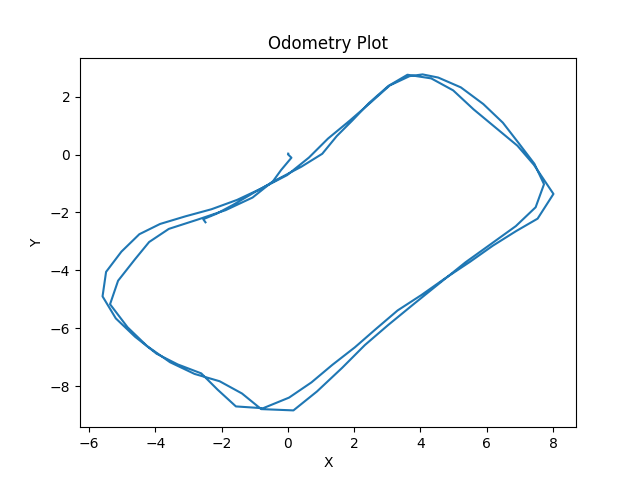
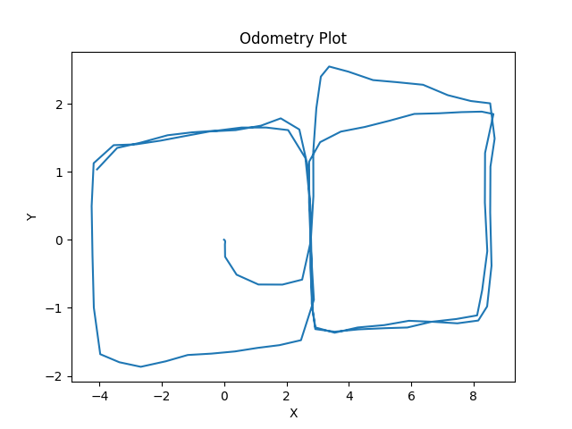

# Table of Contents
1. [Introduction](#introduction)
2. [Getting Started](#getting-started)
   - [Dependencies](#dependencies)
   - [Installation](#installation)
   - [LoGG3D-Net Setup](#logg3d-net-setup)
   - [SuperPoint + SuperGlue Setup](#superpoint--superglue-setup)
3. [Rosbag Files](#rosbag-files)
   - [Office Data](#office-data)
   - [Garage Data](#garage-data)
4. [Usage](#usage)
   - [Option 1: Launch Rosbag file from launch file](#option-1-launch-rosbag-file-from-launch-file)
   - [Option 2: Launch Rosbag file from terminal](#option-2-launch-rosbag-file-from-terminal)
   - [Launch Evaluation](#launch-evaluation)
   - [Launch Custom Evaluation](#launch-custom-evaluation)
   - [Evaluate combination of methods](#evaluate-combination-of-methods)
5. [Evaluation Metrics](#evaluation-metrics)
6. [Configuration](#configuration)
   - [Create own vocabulary for DBoW2](#create-own-vocabulary-for-dbow2)
7. [Results](#results)
   - [Distance-based evaluation](#distance-based-evaluation)
   - [Distance and angle-based evaluation](#distance-and-angle-based-evaluation)
   - [Combined models evaluation (distance-based)](#combined-models-evaluation-distance-based)
   - [Combined models evaluation (distance and angle-based)](#combined-models-evaluation-distance-and-angle-based)
   - [Execution time performance](#execution-time-performance)


# Introduction 
This repository was made to perform comparison and evaluation between different approaches for place recognition. The goal is to provide a comprehensive benchmarking environment for researchers and practitioners to analyze the performance of various place recognition methods. The repository contains the following methods:

1. [SuperPoint + SuperGlue](https://github.com/magicleap/SuperGluePretrainedNetwork)
2. [LoGG3D-Net](https://github.com/csiro-robotics/LoGG3D-Net)
3. [Scan Context](https://github.com/irapkaist/scancontext)
4. [DBoW2](https://github.com/dorian3d/DBoW2)

# Getting Started
## Dependencies

*    ROS (tested with ROS Noetic)
*    Boost
*    PCL 1.8
*    OpenCV
*    Eigen3
*    DBoW2
*    [Livox ROS driver](https://github.com/Livox-SDK/livox_ros_driver)


## Installation

1. Clone the repository into your catkin workspace:

```
cd ~/catkin_ws/src
git clone https://github.com/yourusername/place_recog_eval.git
```
2. Install the required dependencies:

```
sudo apt-get install ros-$(rosversion -d)-pcl-conversions ros-$(rosversion -d)-pcl-ros ros-$(rosversion -d)-message-filters ros-$(rosversion -d)-image-transport ros-$(rosversion -d)-cv-bridge
```

3. Build the package:

```
cd ~/catkin_ws
catkin_make
```

4. Source your workspace:

```
source ~/catkin_ws/devel/setup.bash
```

5. Setup Python environment:

```
pip install -e .
```

### LoGG3D-Net Setup

At first clone LoGG3D-Net repository to **`scripts/methods/` directory!**:
```
cd ~/catkin_ws/src/place_recog_eval/scripts/methods/
git clone https://github.com/csiro-robotics/LoGG3D-Net.git LoGG3D_Net
```

You can create separate environment to install necessary dependencies for LoGG3D-Net. 

* Install requirements:

```
pip install -r requirements.txt
```

* Install PyTorch with suitable cudatoolkit version. For example:
```
pip install torch==1.13.1+cu116 torchvision==0.14.1+cu116 torchaudio==0.13.1 --extra-index-url https://download.pytorch.org/whl/cu116
```

* Install `torchsparse-1.4.0`

```
sudo apt-get install libsparsehash-dev
pip install --upgrade git+https://github.com/mit-han-lab/torchsparse.git@v1.4.0
```

* Download LoGG3D-Net pre-trained models 

```
cd scripts/methods/LoGG3D_Net/
wget -O checkpoints.zip https://cloudstor.aarnet.edu.au/plus/s/G9z6VzR72TRm09S/download
unzip checkpoints.zip
```


### SuperPoint + SuperGlue Setup

1. Install the required dependencies:
```
pip3 install numpy opencv-python torch matplotlib
```

2. Download the pretrained models from the SuperGlue repository:
```
cd scripts/methods/superglue/weights/
wget https://github.com/magicleap/SuperGluePretrainedNetwork/raw/master/models/weights/superglue_indoor.pth
wget https://github.com/magicleap/SuperGluePretrainedNetwork/raw/master/models/weights/superpoint_v1.pth
```

# Rosbag Files

These rosbag files contain data collected at Innopolis University for the purpose of evaluating various place recognition methods. The data is stored in two distinct rosbag files, each representing a different environment: an office room and a laboratory. Both environments feature unique geometries and visual appearances, making them suitable for use as training and testing data.

Each rosbag file contains three topics:

* `/Odometry` (type: `nav_msgs/Odometry`): Odometry information estimated by the SLAM algorithm
* `/camera/color/image_raw_sync` (type: `sensor_msgs/Image`): RGB images from the Intel Depth Camera D435i
* `/livox/lidar_pc` (type: `sensor_msgs/PointCloud2`): Point cloud data from the Livox LIDAR MID-70

## Office Data

**File**: [office_double_loop.bag](https://innopolis-my.sharepoint.com/:u:/g/personal/r_khusainov_innopolis_ru/EbxIWeJWL25AslMtR9_B6l0BIbix3rvijRL5LP9DNZz4tA?e=ny7b9c)

The office data contains two loops in and around an office room. See the figure below for a visual representation of the trajectory.



## Garage Data

**File**: [eight_double_loop.bag](https://innopolis-my.sharepoint.com/:u:/g/personal/r_khusainov_innopolis_ru/ESR00oc6JsFMrPt2d5en0EkBGW5R1DjdN3vbClpj7kf_3g?e=XecIQv)  

The laboratory data captures a figure-eight-shaped trajectory with two loops within a laboratory environment. See the figure below for a visual representation of the trajectory.




# Usage

It's recommended to read rosbag internally to avoid any delays. To do so, set `use_rosbag` to `true` in the `base.launch` file. If you do evaluation on rosbag file, this is the best option to make results reproducible.

## Option 1: Launch Rosbag file from launch file

1. In a `base.launch` file set `use_rosbag` to `true`.

2. In `config.yaml` file set the desired rosbag file pathes.  

`merge_rosbag_input_path` - source rosbag file with point clouds, odometry and images.
`merge_rosbag_output_path` - path to rosbag file with merged point clouds after preprocessing.

3. Launch merge.launch file to merge point clouds from source rosbag file:

```
roslaunch place_recog_eval merge.launch
```

## Option 2: Launch Rosbag file from terminal

1. In a `base.launch` file set `use_rosbag` to `false`.

2. Run rosbag file in separate terminal:

```
rosbag play <rosbag_file>
```

## Launch Evaluation

Launch the evaluation node for the desired method:

* For DBoW:

```
roslaunch place_recog_eval dbow.launch
```

* For Scan Context:

```
roslaunch place_recog_eval context.launch
```

The evaluation results will be printed on the terminal and saved as images.

* For LoGG3D-Net:

```
roslaunch place_recog_eval logg3d.launch
``` 

* For SuperPoint + SuperGlue:

```
roslaunch place_recog_eval superglue.launch
```

You have the option to modify the threshold or other parameters in the respective launch files. By default, the best parameters for each method have been fine-tuned on `loop1.bag`. To further customize the settings, you can edit the `config.yaml` file. A detailed description of each parameter can be found within the file or in [configuration section](#configuration).


## Launch Custom Evaluation

You can modify `evaluate.cpp` or `evaluate.py` files to run custom evaluation. It can be useful if you want to find optimal parameters for your method. All you need is to modify `getMethods()` function and add your method to the list of methods. For example:

To find an optimal threshold for Scan Context just add:  
```cpp  
for (double threshold = 0.01; threshold < 0.1; threshold += 0.01)
{
    BaseMethod *method = new ScanContext(threshold, 0.2);
    methods.push_back(method);
}
```

Then you can run evaluation by launching`evaluate_cpp.launch` or `evaluate_py.launch` files:

```
roslaunch place_recog_eval evaluate_cpp.launch
```

or (for Python):

```
roslaunch place_recog_eval evaluate_py.launch
```

## Evaluate combination of methods

1. Set `save_candidates` to `true` in `config.yaml` file. This will save predicted and real candidates for each method in the `results` folder.

2. Launch evaluation for each method separately. Depends on `angle_consideration`  parameter, results will be stored in `no_angle` or `with_angle` folder in `results` folder.

3. Run `get_results.py` script in `results` folder to get results for combination of methods for each folder (`no_angle` and `with_angle`)):

```
python get_results.py
```
It's used element-wise multiplication of predicted candidates for each method to get final candidates matrix. Then precision, recall, f1 score and accuracy are calculated for final candidates matrix. 

**Note**: after evaluation for each method separately, ground truth file will be created in `results` folder (this file looks like this: real_*.txt). You have to be make sure, that all real_*.txt files are the same. If they are different, corresponding error will be printed in the terminal.

# Evaluation Metrics

The evaluation metrics used in this framework are:

* **Precision**: The ratio of true positive loop closures to the total number of predicted loop closures.  

* **Recall**: The ratio of true positive loop closures to the total number of actual loop closures.

* **F1 Score**: The harmonic mean of precision and recall, providing a balanced measure of the method's performance.

* **Accuracy**: The ratio of correctly identified loop closures (true positives) and correctly identified non-loop closures (true negatives) to the total number of loop closure predictions. This metric measures the overall performance of the place recognition method.

# Configuration  

The `config.yaml` file allows you to configure and customize various parameters for merging and processing point cloud, odometry, and image data. Here are some key parameters you can modify:

*    `merge_rosbag_input_path`: The input path for the rosbag file to be merged.
*    `merge_rosbag_output_path`: The output path for the merged rosbag file.
*    `lidar_raw_topic`, `odom_raw_topic`, `img_raw_topic`: Raw topic names for point cloud, odometry, and image data respectively.
*    `merged_lidar_topic`, `merged_odom_topic`, `merged_camera_topic`: Topic names for the merged point cloud, odometry, and image data.
*    `keyframe_type`: Point cloud accumulation method, either queue-like (0) or batch-like (1).
*    `merge_leaf_size`: Voxel grid filter leaf size for merging point clouds.
*    `cloud_size`: Number of clouds to accumulate before publishing.
*    `record_size`: The number of triplets (point cloud, odometry, and image) to record for evaluation.
*    `min_idx_diff`: The minimum index difference between loop closure candidates.
*    `angle_consideration`: Whether to consider the angle between loop closure candidates.
*    `max_angle_deg`: The maximum angle difference (in degrees) between loop closure candidates.
*    `max_dist`: The maximum distance between loop closure candidates.
*    `save_candidates`: Flag to save loop closure candidates (predicted and real) to a file in the results folder.

By adjusting these parameters, you can customize the merging process, point cloud processing, and loop closure evaluation according to your specific needs and dataset.

Additionally, you can add new place recognition methods by implementing the `BaseMethod` interface and including them in the `methods` directory.

## Create own vocabulary for DBoW2

1. Run roscore:  

```
roscore
```

2. Run the vocabulary creator node:

```
rosrun place_recog_eval dbow_create_vocab
```

3. Run rosbag file in separate terminal:

```
rosbag play <rosbag_file>
```

The resulting vocabulary will be saved in the `include/methods/dbow/` directory.

# Results

## Distance-based evaluation

| Method                | Precision | Recall | F1 Score |
|-----------------------|-----------|--------|----------|
| DBoW2                 | 0.946     | 0.137  | 0.240    |
| SuperPoint + SuperGlue| 0.844     | 0.396  | 0.539    |
| Scan Context          | 0.849     | 0.312  | 0.456    |
| LoGG3D-Net            | 0.792     | 0.122  | 0.211    |

*Table 1: Models evaluation on test data (laboratory environment, eight.bag). True positive here is when two points are close to each other (within 3 meters).*

## Distance and angle-based evaluation

| Method                | Precision | Recall | F1 Score |
|-----------------------|-----------|--------|----------|
| DBoW2                 | 0.941     | 0.324  | 0.482    |
| SuperPoint + SuperGlue| 0.841     | 0.936  | 0.886    |
| Scan Context          | 0.599     | 0.522  | 0.558    |
| LoGG3D-Net            | 0.782     | 0.285  | 0.418    |

*Table 2: Models evaluation on test data (laboratory environment). True positive here is when two points are close to each other (within 3 meters) and oriented in the same direction (within 45 degrees).*  


## Combined models evaluation (distance-based)

| Method                  | Prec.  | Recall | F1    |
|-------------------------|--------|--------|-------|
| DBoW2 + LoGG3D          | 0.977  | 0.060  | 0.113 |
| DBoW2 + Scan C.         | 0.993  | 0.096  | 0.175 |
| (S.P. + S.G.) + Scan C. | 0.967  | 0.211  | 0.346 |
| (S.P. + S.G.) + LoGG3D  | 0.939  | 0.120  | 0.213 |

*Table 3: Combined models evaluation on test data. True positive here is when two points are close to each other (within 3 meters). Note: S.P. = SuperPoint, S.G. = SuperGlue.*  

## Combined models evaluation (distance and angle-based)

| Method                  | Prec.  | Recall | F1    |
|-------------------------|--------|--------|-------|
| DBoW2 + LoGG3D          | 0.977  | 0.142  | 0.248 |
| DBoW2 + Scan C.         | 0.993  | 0.228  | 0.371 |
| (S.P. + S.G.) + Scan C. | 0.967  | 0.500  | 0.659 |
| (S.P. + S.G.) + LoGG3D  | 0.939  | 0.285  | 0.438 |

*Table 4: Combined models evaluation on test data. True positive here is when two points are close to each other (within 3 meters) and oriented in the same direction (within 45 degrees). Note: S.P. = SuperPoint, S.G. = SuperGlue.*

## Execution time performance

| Method                | Processing unit(s) | Total Duration (s) |
|-----------------------|--------------------|--------------------|
| DBoW2                 | CPU                | 2.65               |
| SuperPoint + SuperGlue| CPU + GPU          | 357.96             |
| Scan Context          | CPU                | 0.35               |
| LoGG3D-Net            | CPU + GPU          | 10.00              |

*Table 5: Execution time performance of each method on 100 frames (i.e., 100 seconds of data).*  